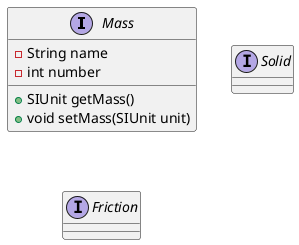

## Gravity

$$
F = G \frac{m_1 m_2}{r^2}
$$

Needs:
 - position
 - mass
 - Gravitational constant

### Acceleration from gravity force

$$
a = \frac{m}{F}
$$

From Newton's second law.

## Aerodynamic drag

$$
F_D = \frac{1}{2}pv^2C_DA
$$

Needs:
 - density of the fluid
   - depends on positions in an atmosphere
 - speed relative to fluid
   - depends on rotation of fluid body
 - cross sectional area
 - drag coefficient

### Drag coefficient

[Drag coefficient on wikipedia](https://en.wikipedia.org/wiki/Drag_coefficient)

Needs:
 - shape
 - movement direction and speed relative to fluid

### Zero elevation height

Because most celestial bodies do not posses an ocean of any kind measurements relative to 'sea level' are not feasible.
An arbitrary elevation is instead designated as 'zero elevation' and all calculations are done relative to this height.

