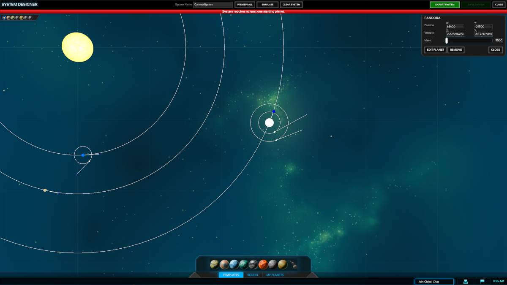

# Examples

## Orbiter

Orbiter ist ein Weltraum-Flugsimulator mit Fokus auf realistische physikalische Berechnung.

Positiv:
 - Der Szenarioeditor ist direkt in der Simulation integriert und kann jederzeit geöffnet werden
 - Orbit kann exakt per Eingabe der sechs Orbitalparameter eingestellt werden
 - Einheiten werden per Dropdown eingestellt und umgerechnet
 - Einstellungen werden in Untermenüs gegliedert
 
Negativ:
 - Keine ineditor Erklärung zu den Elementen, nur mit Vorwissen bedienbar
 - Wechsel zwischen verschiedenen Objekten kann mehrere Sekunden zum nachladen der Umgebung in Anspruch nehmen, besonders Terrain

## KSP - Kerbal Space Program

Kerbal Space Program ist ein Weltraum-Flugsimulator welcher Spielspass und Bedienfreundlicheit über Realismus setzt.
Das Standardspiel selbst besitzt keinen Editor, jedoch sind mehrere Mod und Externe Lösungen verfügbar.
Hier betrachtet ist die KerbalEdu Mission Library welche an Lehrer gerichtet ist welcher Schülern eine interaktive Möglichkeit zum erlernen von Orbitalmechanik bieten will.

Positiv:
 - Bedienbar ohne Vorkentnisse
 - Übersichtlich, von oben gegen unten von generellen Einstellungen zu Details
 - Vorgefertigte Aufgaben/Ziele der Mission können per Dropdown ausgewählt und hinzugefügt werden
 
Negativ:
 - Sonnensystem mit allen Planetoiden ist fix und kann nicht editiert werden
 - Keine exakten Einstellungen des Orbits eines Raumschiffs möglich
 - Keine exakten Aufgaben/Ziele möglich

## PA - Planetary Annihilation

Planetary Annihilation ist ein RTS-Spiel welches auf bombastisch aussehende Massenschlachten mit einfacher Bedienung fokussiert.

Positiv:
 - Fokus auf die graphische Darstellung des geplanten Systems
 - Detailinformationen zu einem Orbit nur sichtbar wenn Planet aktiv angewählt
 - Invalide Startbedingungen werden mit roter Balkenwarnung ausgegeben ohne die Arbeit zu unterbrechen
 - Bestehende Himmelskörper können von der mittig unten platzierten Template-Leiste direkt ins System eingefügt werden per Drag  & Drop
 - Graphische Representation des Orbits und Geschwindigkeit
 - Doppelklick auf einen Planeten öffnet den Detaileditor zum Planeten
 - Simple simulation per Simulate-Button oben mitte möglich um Konstellationen auszutesten
 
Negativ:
 - Nur 2d editierung von oben
 - Eltern-Kind Orbitbeziehung wird nicht dargestellt oben links in der Systenübersicht
 - Sysatemübersicht nur per Bild, mehrere Planeten des gleichen Typs besitzen das gleche Bild
 - Orbit wird nur für einen Partner errechnet
 - Simulationsfunktion kann die Simulation nicht zurücksetzten
 - Einen neuen Planeten per Drag & Drop einzufügen verursacht einen Reaktionsunterbruch/Lag von mehreren Sekunden bevor der Planet in der graphischen Darstellung erscheint. 

